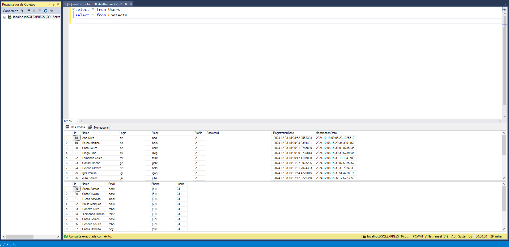

# Contact Manager

**Contact Manager** é um projeto desenvolvido em .NET Core que implementa um sistema de autenticação completo com funcionalidades de gerenciamento de usuários e contatos. Ele utiliza o padrão de arquitetura **MVC (Model-View-Controller)**, garantindo uma separação clara entre lógica de apresentação, lógica de negócios e acesso a dados.

## Funcionalidades

- **Autenticação e Autorização**:

  - Login de usuários com validação e segurança.
  - Recuperação de senha via e-mail.
  - Hashing de senhas para maior segurança.
  - Restrição de acesso com filtros para usuários logados e administradores.

- **Gerenciamento de Usuários**:

  - Criação, edição e exclusão de usuários.
  - Listagem e visualização de detalhes.
  - Contagem dinâmica de contatos associados a cada usuário.

- **Gerenciamento de Contatos**:

  - Criação, edição e exclusão de contatos.
  - Pesquisa por e-mail.
  - Contador de contatos para cada usuário, atualizado automaticamente.

- **Alteração de Senha**:

  - Funcionalidade para alteração de senha, permitindo que o usuário atualize sua senha através de um fluxo seguro.

- **Interface de Navegação**:

  - Sistema de menu dinâmico.
  - Layouts distintos para usuários logados e não logados.

- **Outros Recursos**:
  - Pop-ups de confirmação para ações importantes.
  - Mensagens de erro e validação personalizadas.

## Estrutura do Projeto

```
ContactManager/
├── Controllers/                     # Diretório contendo os controladores responsáveis pela lógica de negócios.
│   ├── ChangePasswordController.cs  # Gerencia a funcionalidade de mudança de senha do usuário.
│   ├── ContactController.cs         # Gerencia funcionalidades relacionadas a contatos, como criação, leitura, atualização e exclusão.
│   ├── HomeController.cs            # Gerencia a página inicial do aplicativo.
│   ├── LoginController.cs           # Gerencia o fluxo de autenticação, incluindo login e recuperação de senha.
│   ├── RestrictController.cs        # Gerencia páginas restritas, acessíveis apenas para usuários autenticados.
│   ├── UserController.cs            # Gerencia operações de CRUD de usuários.
│
├── Data/
│   ├── Map/
│   │   └── ContactMap.cs            # Mapeamento de dados para contatos.
│   ├── DataContext.cs               # Contexto do banco de dados (Entity Framework).
│
├── Enums/
│   └── EnumProfile.cs               # Enumerações para perfis e permissões.
│
├── Filters/
│   ├── LoggedUserPage.cs            # Filtro para páginas acessíveis apenas por usuários logados.
│   └── RestrictPageOnlyAdmin.cs     # Filtro para páginas restritas apenas a administradores.
│
├── Helper/
│   ├── Cryptography.cs              # Implementa o sistema de hashing de senhas.
│   ├── Email.cs                     # Implementação para envio de e-mails.
│   ├── IEmail.cs                    # Interface para a funcionalidade de envio de e-mails.
│   ├── ISection.cs                  # Interface para gerenciamento de seções de configuração.
│   └── Section.cs                   # Implementação da interface de gerenciamento de seções.
│
├── Migrations/
├── Models/
│   ├── ChangePasswordModel.cs       # Modelo para a funcionalidade de mudança de senha.
│   ├── ContactModel.cs              # Modelo para dados de contato.
│   ├── ErrorViewModel.cs            # Modelo para exibição de erros.
│   ├── HomeModel.cs                 # Modelo para a página inicial.
│   ├── LoginModel.cs                # Modelo para a funcionalidade de login.
│   ├── ResetPasswordModel.cs        # Modelo para a funcionalidade de recuperação de senha.
│   └── UserModel.cs                 # Modelo para dados de usuário.
│
├── Properties/
├── Repository/
│   ├── ContactRepository.cs         # Repositório para operações relacionadas a contatos.
│   ├── IContactRepository.cs        # Interface para repositório de contatos.
│   ├── IUserRepository.cs           # Interface para repositório de usuários.
│   └── UserRepository.cs            # Repositório para operações relacionadas a usuários.
│
├── Screenshots/
│
├── ViewComponents/
│   └── Menu.cs                      # Componente dinâmico de menu.
│
├── Views/
│   ├── ChangePassword/             # Diretório com as views para a funcionalidade de mudança de senha.
│   ├── Contact/                    # Diretório com as views para gerenciamento de contatos.
│   ├── Home/                       # Diretório com as views para a página inicial.
│   ├── Login/                      # Diretório com as views para login e recuperação de senha.
│   ├── ResetPassword.cshtml        # View para a recuperação de senha.
│   ├── Restrict/                   # Diretório com as views para páginas restritas.
│   ├── Shared/                     # Diretório com layouts e componentes compartilhados.
│   └── User/                       # Diretório com as views para gerenciamento de usuários.
│
├── wwwroot/
│
├── Program.cs


```

## Tecnologias Utilizadas

- **Linguagem**: C#
- **Framework**: ASP.NET Core MVC
- **Banco de Dados**: SQL Server com Entity Framework Core ( Tabelas relacionais )
- **Front-end**: HTML, CSS, Razor Pages, JavaScript
- **Estilização e Responsividade**: Bootstrap
- **Funcionalidades Avançadas**: jQuery para pop-ups e interatividade
- **Segurança**: Hashing de senhas (SHA1) e filtros de autorização
- **Outras Ferramentas**:
  - Envio de e-mails (System.Net.Mail)
  - Componentes dinâmicos com View Components

## Design Patterns

- **MVC (Model-View-Controller)**: Organização principal do projeto.
- **Repository Pattern**: Implementado para abstrair o acesso aos dados.
- **Factory Pattern**: Utilizado na criação de objetos reutilizáveis.

## Imagens do Projeto





## Contribuição

Contribuições são bem-vindas. Sinta-se à vontade para abrir issues ou enviar pull requests.

---

Desenvolvido por Nathanael Da Silva Farias.
